# Device Info

Device Info is an Android app that shows detailed information about your device such as hardware, system, memory, CPU, battery, network, sensors, and installed apps.

This project is mainly built for learning Android development and understanding how Android system APIs work, while also being useful for users.

  

## Features
- **Device hardware and system information**  
  View basic device details such as model, Android version, and system properties in one place.

- **CPU and memory details**  
  Check CPU cores, usage, and memory information to better understand device performance.

- **Battery status and health**  
  See battery level, charging status, charging state, and battery health information.

- **Network information (Wi-Fi / Mobile)**  
  Shows current connection type, signal strength, IP address, DNS, and real-time network speed.

- **Display information**  
  View display-related details such as screen resolution, density, refresh rate, HDR/Wide color gamut support, supported display features, and multitouch capability.

- **Sensors availability**  
  Lists available sensors on the device and helps verify whether a sensor is present or not.

- **Installed apps list**  
  Displays all installed applications along with useful details such as the permissions each app is using.

## Tech Used
- Kotlin
- Jetpack Compose
- MVVM architecture
- Hilt (Dependency Injection)
- Coroutines & Flow

## Screenshots

| Dashboard | System | CPU |
|----------|--------|-----|
| 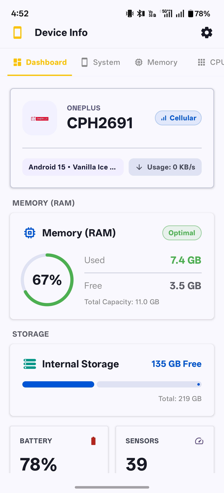 | 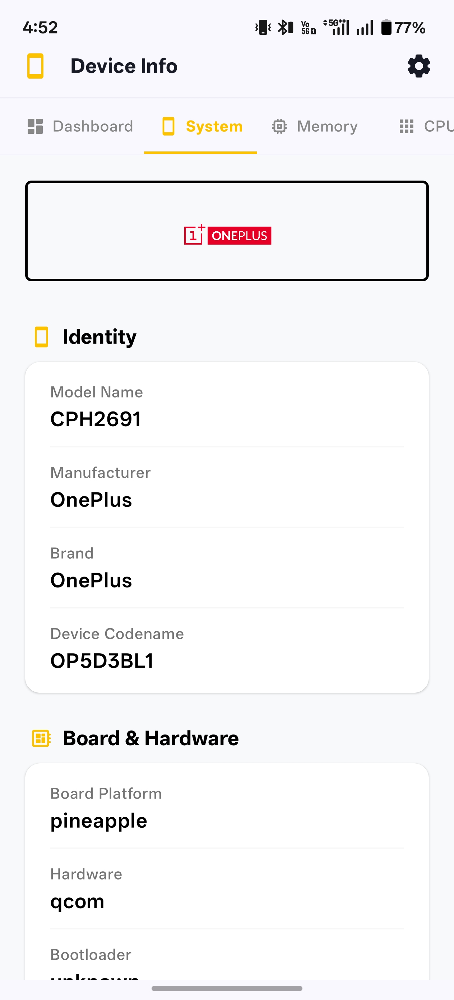 | 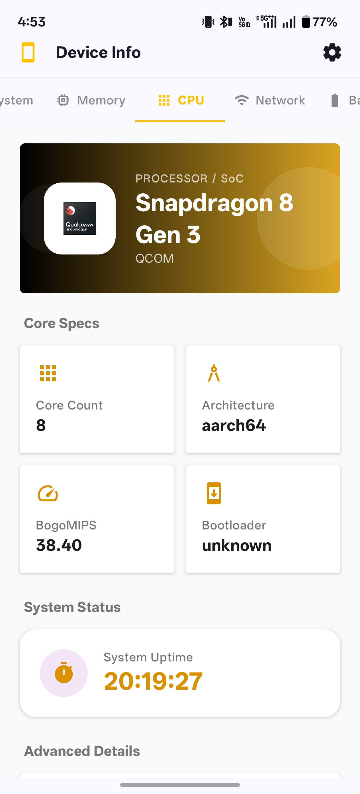 |

| Memory | Network | Battery |
|--------|---------|---------|
| 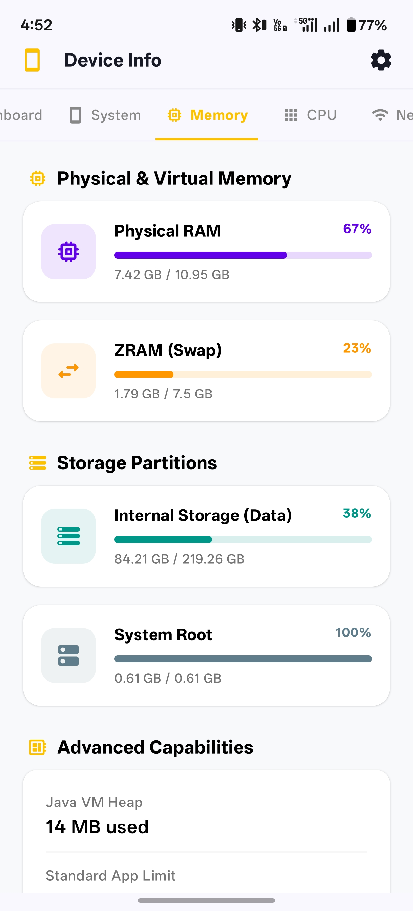 | 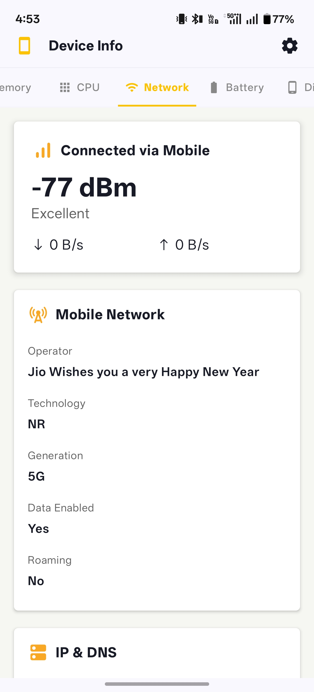 | 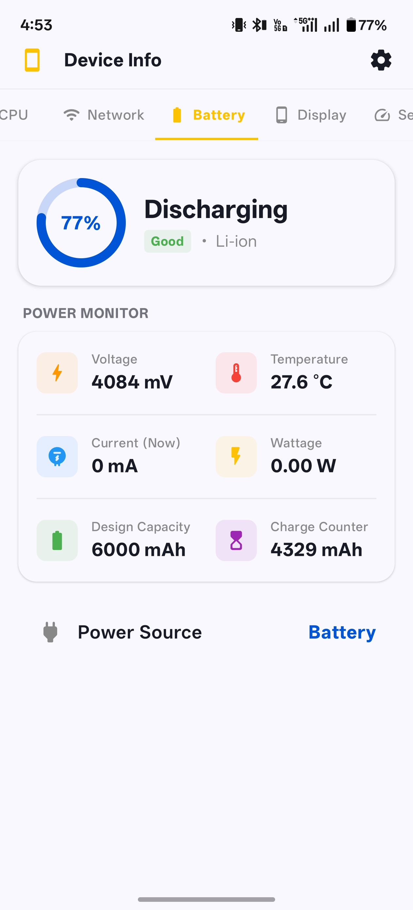 |

| Display | Sensors | Apps |
|---------|---------|------|
| 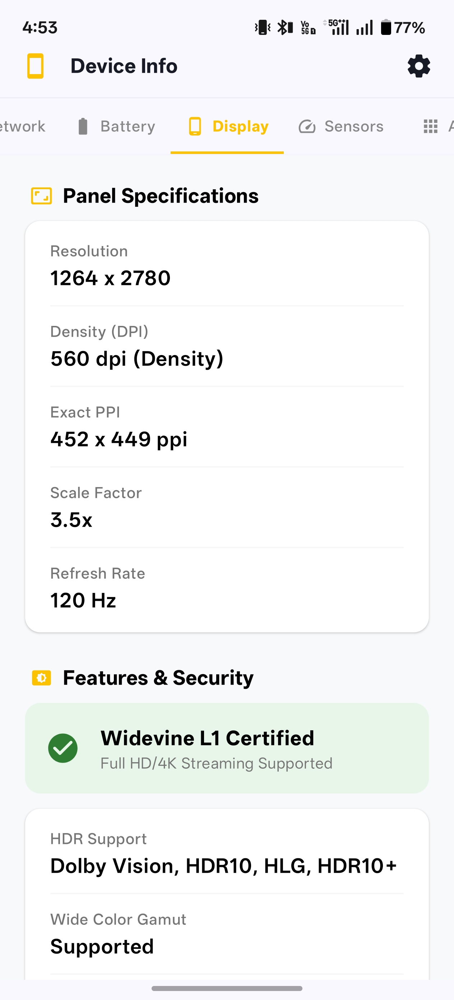 | 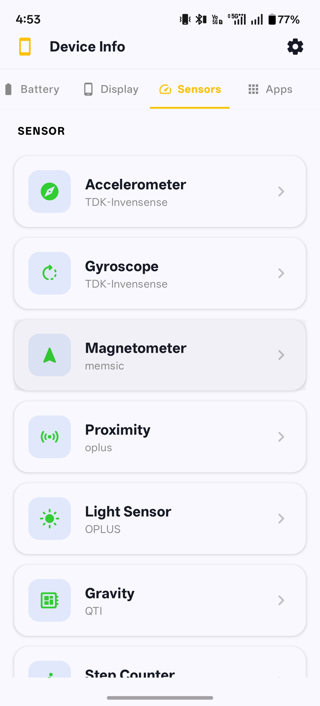 | 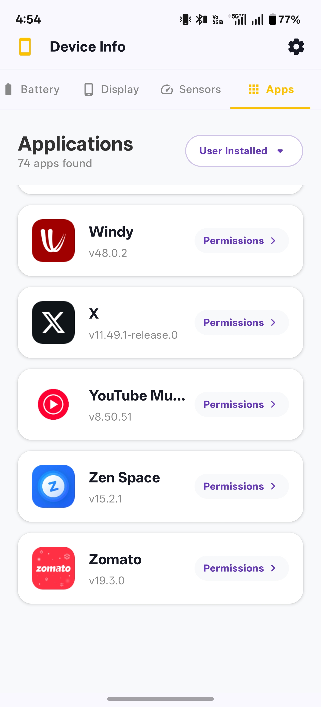 |

| Permissions | Accelerometer | Gyroscope |
|-------------|---------------|-----------|
| 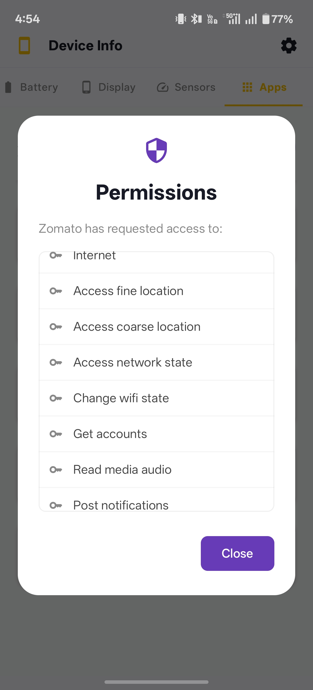 | 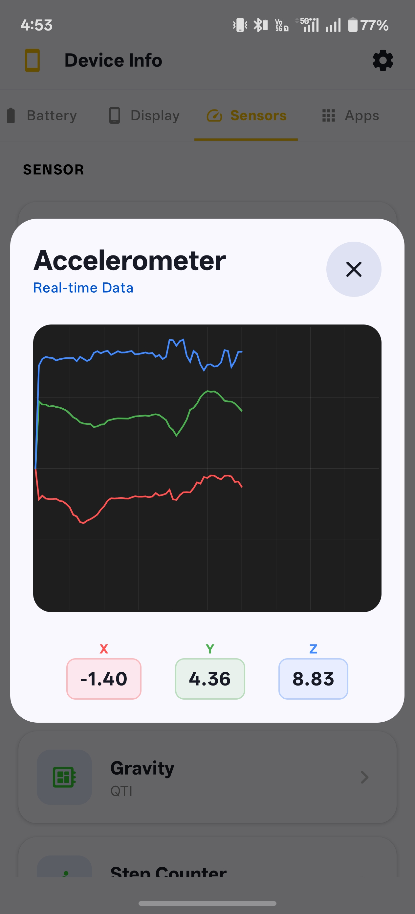 | 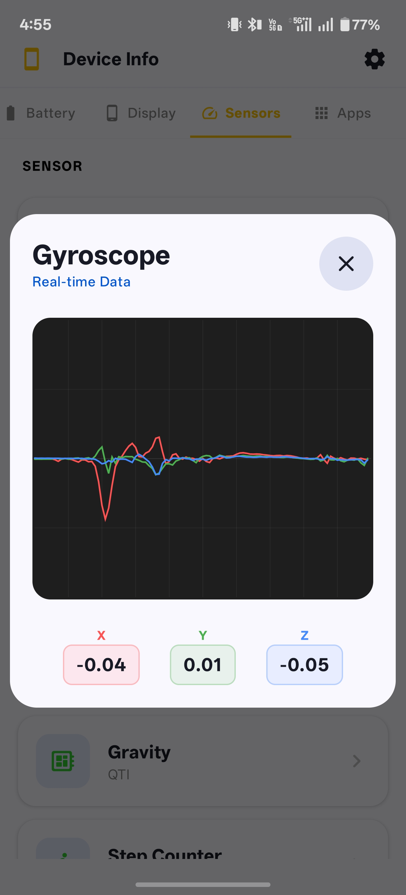 |

## Privacy
This app does not collect or share any personal data.  
All information is read locally from the device using Android APIs.

